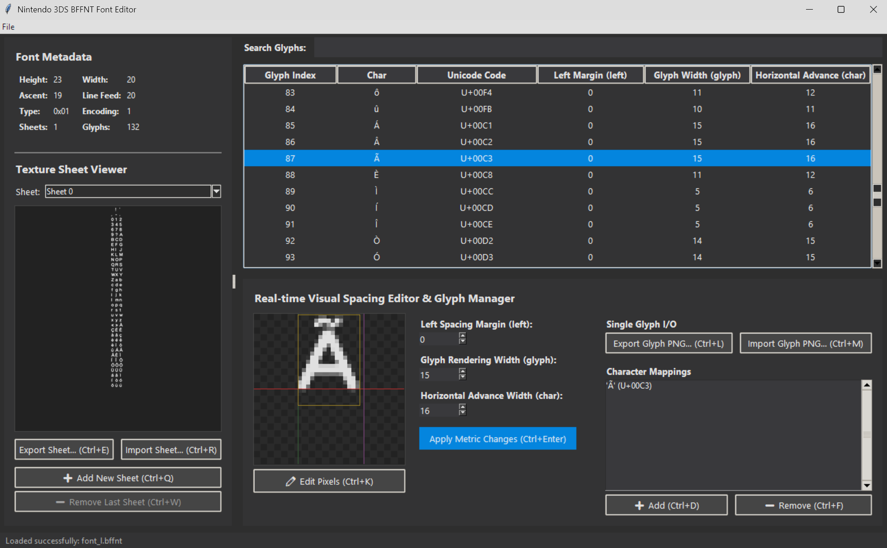
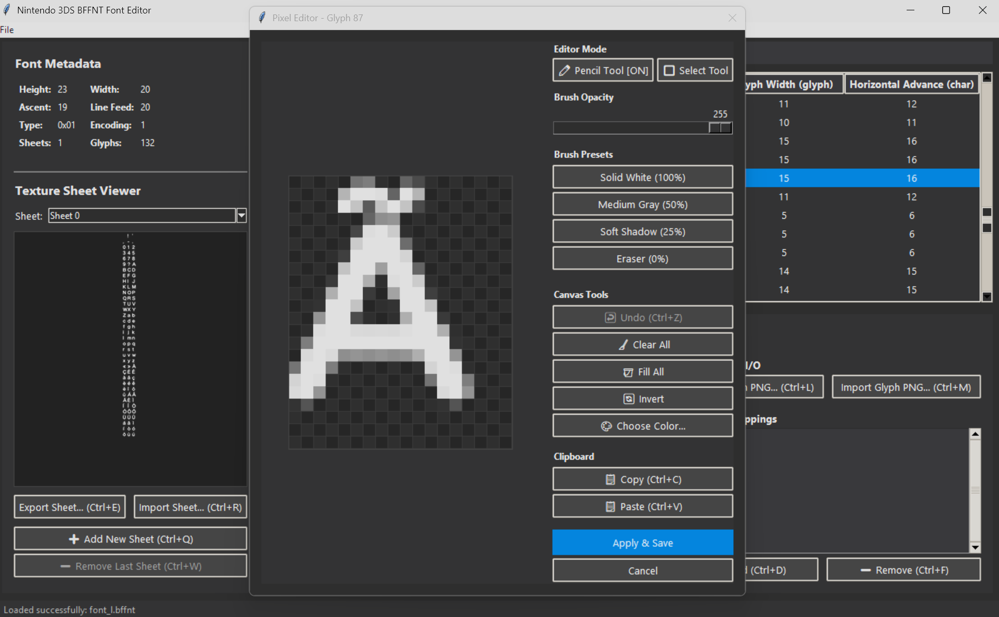
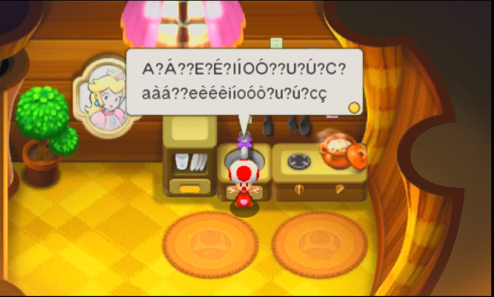
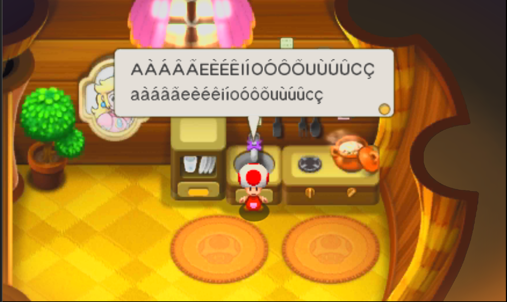

# BFFNT Font Editor

This is a graphical editor for Nintendo 3DS .bffnt and .ffnu font files. It was originally created for the Brazilian Portuguese translation project of *Mario & Luigi: Bowser's Inside Story + Bowser Jr.'s Journey*, but it should work with any BFFNT file made for the 3DS. The editor allows you to modify glyph textures, adjust spacing metrics, edit character mappings, and manage texture sheets.

## Screenshots

### Main Interface


### Pixel Editor


## In-Game Comparison

Below is a side-by-side comparison of the game's text rendering before and after custom glyph modification and character mapping adjustments:

<table>
  <tr>
    <td align="center"><b>Before</b></td>
    <td align="center"><b>After</b></td>
  </tr>
  <tr>
    <td></td>
    <td></td>
  </tr>
</table>


## Features

* **BFFNT Parser & Packer**: Reads and writes Nintendo 3DS font files. Handles endianness automatically, updates section offsets, and adjusts file size fields on saving.
* **Dark Mode GUI**: Simple dark interface with contrasting panels to keep things clean.
* **Pixel Editor**:
  * Double-click any glyph to edit its pixels on a grid.
  * Pencil tool with customizable transparency.
  * Selection tool to select areas.
  * Class-level and system clipboard copy/paste. You can run two separate instances of the editor and copy/paste pixels between them without losing data.
  * Undo history of up to 50 actions.
* **Visual Spacing Editor**: Adjust spacing fields with real-time preview guidelines showing margins, glyph width, and horizontal advance.
  * **Left Spacing (left)**: Changes starting offset of the character.
  * **Glyph Width (glyph)**: Changes rendering width of the glyph texture.
  * **Horizontal Advance (char)**: Changes spacing before the next character in-game.
* **Character Mappings**: Map symbols to glyph indexes. Supports adding new characters and removing old ones. Automatically manages internal TABLE and SCAN mapping types to avoid game compatibility issues.
* **Texture Sheet Manager**:
  * Add new empty sheets or remove the last sheet.
  * Export/import sheets or single glyphs as PNG.
* **Drag and Drop**: Drag a .bffnt file directly into the window to open it.

## Keyboard Shortcuts

### Main Window

| Action | Shortcut | Description |
| :--- | :--- | :--- |
| **Open File** | <kbd>Ctrl</kbd> + <kbd>O</kbd> | Select and load a `.bffnt` file |
| **Save File** | <kbd>Ctrl</kbd> + <kbd>S</kbd> | Save changes back to the active file |
| **Save As** | <kbd>Ctrl</kbd> + <kbd>Shift</kbd> + <kbd>S</kbd> | Save file with a new name |
| **Edit Pixels** | <kbd>Ctrl</kbd> + <kbd>K</kbd> | Open the Pixel Editor window (or double-click preview) |
| **Apply Metrics** | <kbd>Ctrl</kbd> + <kbd>Enter</kbd> | Apply values from Left, Glyph, and Character fields |
| **Add Mapping** | <kbd>Ctrl</kbd> + <kbd>D</kbd> | Map a new character to the selected glyph |
| **Remove Mapping** | <kbd>Ctrl</kbd> + <kbd>F</kbd> | Delete a mapping from the selected glyph |
| **Export Glyph** | <kbd>Ctrl</kbd> + <kbd>L</kbd> | Export selected glyph as transparent PNG |
| **Import Glyph** | <kbd>Ctrl</kbd> + <kbd>M</kbd> | Replace selected glyph with external PNG |
| **Export Sheet** | <kbd>Ctrl</kbd> + <kbd>E</kbd> | Save current texture sheet as full PNG |
| **Import Sheet** | <kbd>Ctrl</kbd> + <kbd>R</kbd> | Replace current texture sheet with PNG |
| **Add Sheet** | <kbd>Ctrl</kbd> + <kbd>Q</kbd> | Append an extra blank sheet to the font |
| **Remove Sheet** | <kbd>Ctrl</kbd> + <kbd>W</kbd> | Delete the final sheet and its slots |

### Pixel Editor Window

| Action | Shortcut | Description |
| :--- | :--- | :--- |
| **Copy** | <kbd>Ctrl</kbd> + <kbd>C</kbd> | Copy selected area (or whole glyph if no selection) |
| **Paste** | <kbd>Ctrl</kbd> + <kbd>V</kbd> | Paste copied pixels (works across different editor instances) |
| **Undo** | <kbd>Ctrl</kbd> + <kbd>Z</kbd> | Undo last pixel operation |
| **Apply & Exit** | <kbd>Ctrl</kbd> + <kbd>S</kbd> | Save pixel modifications and exit the window |

## Requirements and Usage

You need Python 3 and the dependencies listed in `requirements.txt` (Pillow and tkinterdnd2) to run this.

### Installation
Install the required dependencies using pip:
```bash
pip install -r requirements.txt
```

### Running the tool
Run the script using python:
```bash
python bffnt_editor.py
```

You can also drag and drop a .bffnt file onto the script window, or pass it directly as a command-line argument:
```bash
python bffnt_editor.py "C:\path\to\your\file.bffnt"
```

## Tips and Info
* **Adding Characters**: When mapping a new symbol like "Ç" or "ã", click Add (<kbd>Ctrl</kbd> + <kbd>D</kbd>) and input the letter directly or its Unicode format (like U+00C7).
* **TABLE vs SCAN**: The script handles mapping placement. If a character falls inside a standard TABLE index range, it edits it there. If not, it falls back to a SCAN section so the game registers it properly without crashing.
